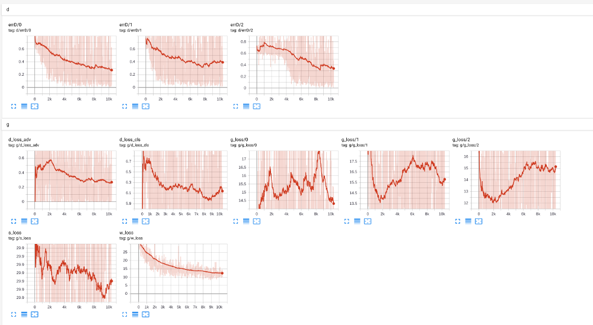

# ZSL-AttnGAN

Using GAZSL from [A Generative Adversarial Approach for Zero-Shot Learning from Noisy Texts](https://arxiv.org/pdf/1712.01381.pdf) [1] in [AttnGAN](http://openaccess.thecvf.com/content_cvpr_2018/papers/Xu_AttnGAN_Fine-Grained_Text_CVPR_2018_paper.pdf) [2] model.

# Problem statements
One wants to use noisy texts in AttnGan to generate birds. 
This yelds the following challenges:
- sentences are of arbitrary length
- not all sentences are relevant

we may improve the original model with GANs for Zero-shot learning [1] to generate better (in any sence) text and image embeddings.

# Possible solutions
In the original AttnGAN model there are two types of text-modality embeddings: Word-level embeddings and Sentence-level embeddings (an average over all words). Hence, there are several ways how we can use ZSL within the model:
1. Use ZSL encoder (text/image) to summarize text, image into matrix of embeddings (pseudo-words) or word-level embeddings (fully replace original encoder). Matching distribution between words and matrix of image features
2. Use ZSL encoder (text/image) on top of encoded words and matrix of image features. ZSL_ENC: W -> emb
3. Use ZSL encoder (text/image) on top of sentence embedding and sentence of image features. ZSL_ENC: W.mean() -> emb
4. Incorporate ZSL approach in the training phase, not pretraining one

# Implemented solution
To keep things simple I've built ZSL Generator and ZSL Discriminator on top of average embeddings obtained from the original encoders architecture (ZSL_ENC: W.mean() -> emb). The overall task is to introduce adversarial and classification loss via discriminative model into optimization objective.

- Because in the original ZSL Paper WGAN + GP is used it is usually recommended to update Discriminator more frequently than Generator (5:1 in the original ZSL code), for the sake of simplicity I ignore that fact and use the vanilla adv. loss function.
- Visual pivot regularization from the original paper is dropped
- We can omit KL-Loss because we have introduced stochastic part in Sentence Embedder (ZSL part uses z ~ N)
- There may be some bugs, need to perform further checks

# TODO:
- Choose better adv. loss function and hacks from other papers
- Try to incorporate ZSL for word-level embeddings (ZSL_ENC: W -> emb) and for training step (not pretraining one)
- Test eval
- Tune hyperparams
- TODOs in the code

# Results:
- DASSM model was trained for 200 epochs. However it may was only one run, so probbably there may be bugs
- Main model is training, however it's required to tune lambdas and smoothing factors to balance components of the objective function (see image below)

# Weights
[Yandex.Disk](https://yadi.sk/d/EA1VP5namRh7Gw)
